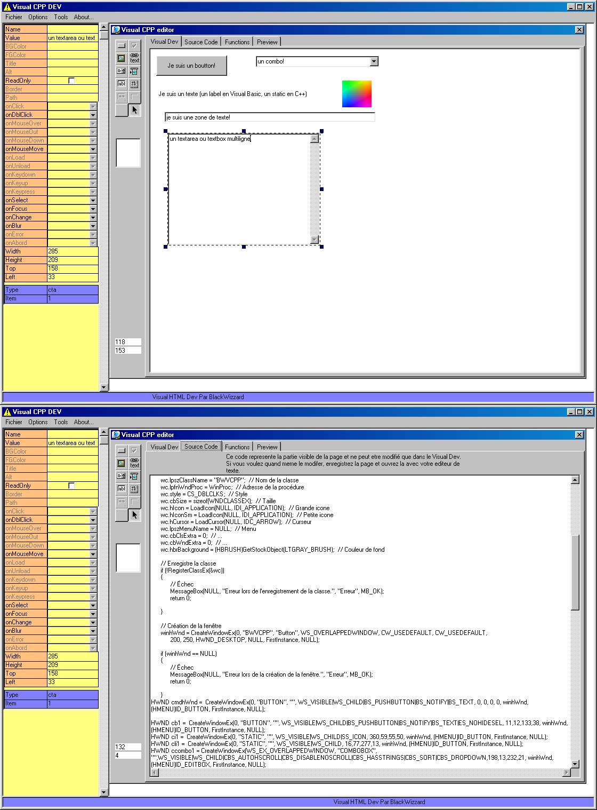



## Visual C\+\+ Builder \- all in VB code\!  \*Must See\*

### Description

Incredible code! This is The famous Visual C++ but created in VB! there's no bug in generated code and you can launch and compile it with your standard cpp compiler...Please, see screen shot and vote for it if you like! (it's my hold app "Visual HTML" that I've modified to generate CPP code). There is now a project generator for export in dev-cpp and VC++ project!  ***Please Vote!***
 
### More Info
 

             |
---                |---
**Submitted On**   |2001-10-14 01:39:52
**By**             |[BlackWizzard](https://github.com/Planet-Source-Code/PSCIndex/blob/master/ByAuthor/blackwizzard.md)
**Level**          |Advanced
**User Rating**    |4.8 (82 globes from 17 users)
**Compatibility**  |VB 5\.0, VB 6\.0
**Category**       |[Complete Applications](https://github.com/Planet-Source-Code/PSCIndex/blob/master/ByCategory/complete-applications__1-27.md)
**World**          |[Visual Basic](https://github.com/Planet-Source-Code/PSCIndex/blob/master/ByWorld/visual-basic.md)
**Archive File**   |[Visual C\+\+2891110132001\.zip](https://github.com/Planet-Source-Code/blackwizzard-visual-c-builder-all-in-vb-code-must-see__1-28005/archive/master.zip)

